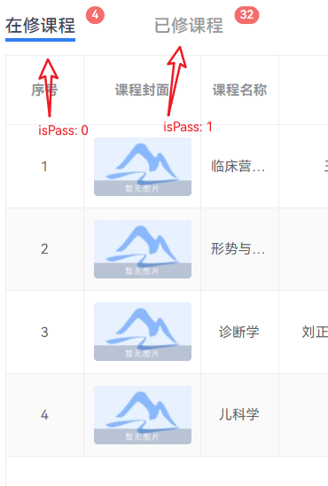

## Qddx Course

刷课思路:   
1. flat 所有课程的 cell
2. 

### 获取所有课程

#### 请求
POST http://xxxxxx.cn/LearningSpace/list

Accept: application/json, text/plain, */*  
Accept-Encoding: gzip, deflate  
Accept-Language: zh-CN,zh;q=0.9,en;q=0.8  
access-token: xxx
Connection: keep-alive  
Content-Length: 65  
Content-Type: application/json;charset=UTF-8  
Host: xxxxxx.cn  
User-Agent: Mozilla/5.0 (Windows NT 10.0; Win64; x64) AppleWebKit/537.36 (KHTML, like Gecko) Chrome/111.0.0.0 Safari/537.36

{
"isPass": 1,
"order": "",
"orderField": "",
"pageNum": 1,
"pageSize": 10
}
#### 响应
application/json

#### 说明

### 获取课程目录

#### 请求
GET http://xxxxxx.cn/studyLearn/courseDirectoryProcess?courseOpenId={ID}

Accept: application/json, text/plain, */*  
Accept-Encoding: gzip, deflate  
Accept-Language: zh-CN,zh;q=0.9,en;q=0.8  
access-token: exxxx
Connection: keep-alive  
Host: xxxxxx.cn  
User-Agent: Mozilla/5.0 (Windows NT 10.0; Win64; x64) AppleWebKit/537.36 (KHTML, like Gecko) Chrome/111.0.0.0 Safari/537.36

#### 响应
application/json

#### 说明

## 刷课流程

### 1. 进入课程

POST http://xxxxxx.cn/process/addedQuestionList  

Accept: application/json, text/plain, */*  
Accept-Encoding: gzip, deflate  
Accept-Language: zh-CN,zh;q=0.9,en;q=0.8  
access-token: xxxx
Connection: keep-alive  
Content-Length: 103  
Content-Type: application/json;charset=UTF-8  
Host: xxxxxx.cn  
User-Agent: Mozilla/5.0 (Windows NT 10.0; Win64; x64) AppleWebKit/537.36 (KHTML, like Gecko) Chrome/111.0.0.0 Safari/537.36  

{
"cellId": "c705fad8-c602-46d5-8df2-e0ed48c609d9",
"courseOpenId": "41b04cdd-c46e-4d2c-b7ad-00de79567557"
}

### 2. 获取课程详细信息 LogId

GET http://xxxxxx.cn/studyLearn/cellDetail?cellId=c705fad8-c602-46d5-8df2-e0ed48c609d9  

Accept: application/json, text/plain, */*  
Accept-Encoding: gzip, deflate  
Accept-Language: zh-CN,zh;q=0.9,en;q=0.8  
access-token: eyJhbGciOiJxxxyJzdWIiOiIxMTA2xxxx
Connection: keep-alive  
Host: xxxxxx.cn  
Origin: http://student.jxjyzx.qdu.edu.cn  
Referer: http://student.jxjyzx.qdu.edu.cn/  
User-Agent: Mozilla/5.0 (Windows NT 10.0; Win64; x64) AppleWebKit/537.36 (KHTML, like Gecko) Chrome/111.0.0.0 Safari/537.36  

### 3. 发送 LeaveLog

POST http://xxxxxx.cn/studyLearn/leaveCellLog

POST /studyLearn/leaveCellLog HTTP/1.1  
Accept: application/json, text/plain, */*  
Accept-Encoding: gzip, deflate  
Accept-Language: zh-CN,zh;q=0.9,en;q=0.8  
Connection: keep-alive  
Content-Length: 78  
Content-Type: application/json;charset=UTF-8  
Host: xxxxxx.cn  
User-Agent: Mozilla/5.0 (Windows NT 10.0; Win64; x64) AppleWebKit/537.36 (KHTML, like Gecko) Chrome/111.0.0.0 Safari/537.36  
access-token: xxxxx

{
    "id": "e7f59f30-937b-4348-aeac-d3a80a21e31b",
    "stopSeconds": 0,
    "videoEndTime": 0
}

